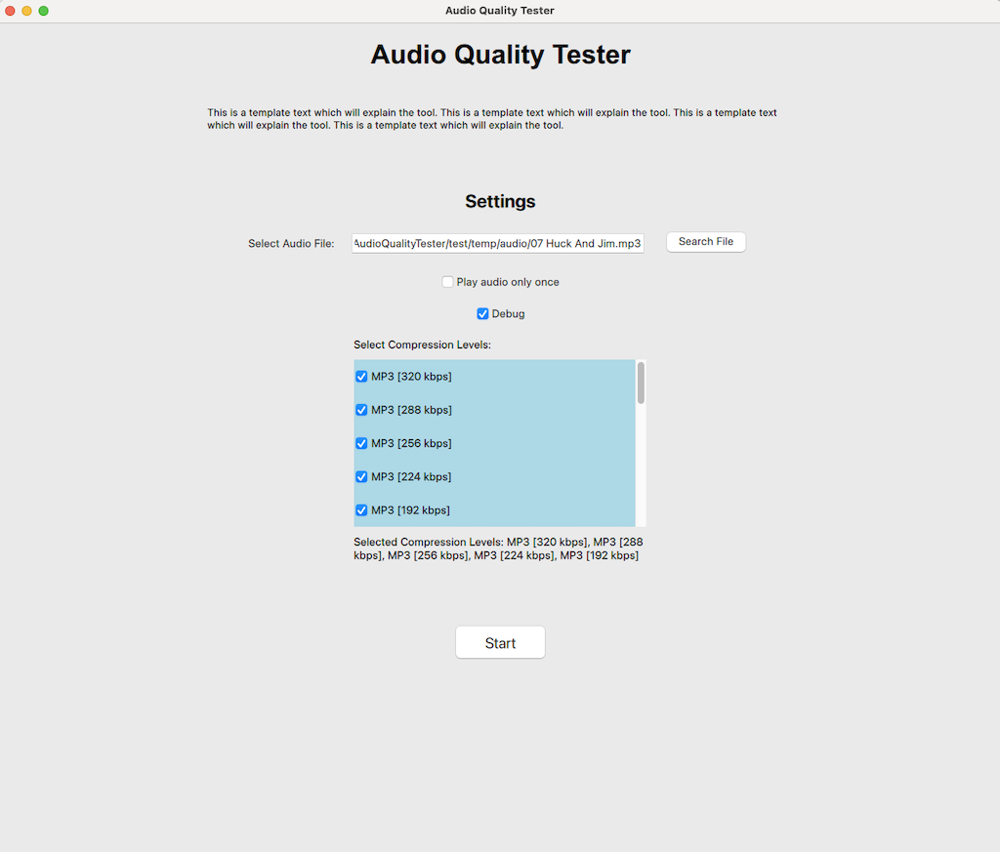
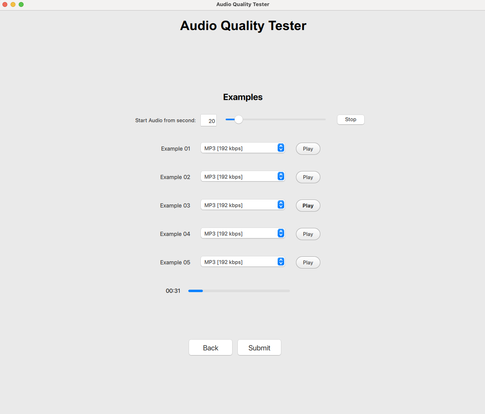
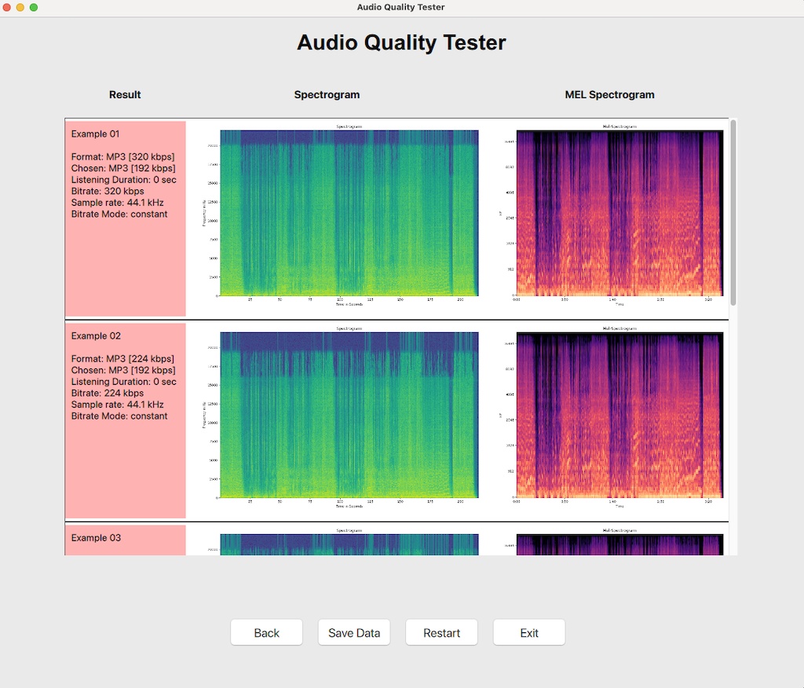

# Audio Quality Tester
The Audio Quality Tester is a Python tool with GUI that let's you compare lossy MP3 formats. The aim is to find out at what point a person is no longer able to differentiate the file formats. Currently suppoerted input file formats are MP3 and WAV.

## Table of Contents
- [1 Getting Started](#1-getting-started)
- [2 Documentation](#2-documentation)
- [3 Known Issues & Roadmap](#3-known-issues-and-roadmap)
- [4 License](#4-license)

## 1 Getting Started
Download the release file and pip-install it or build it from source. You need to install ffmpeg.

**FFMPEG**
- macOS: brew install ffmpeg
- Ubuntu/Debian: sudo apt-get install ffmpeg
- Windows: Download FFmpeg from ffmpeg.org and add it to the system PATH.

Launch the main function to start the program: 
```
import audioQualityTester

audioQualityTester.main()
```

## 2 Documentation
The tool will start a GUI which consists out of three screens.

### 2.1 Start Screen
In the start screen you input the path to your audio file. It must be a MP3 with 320kbps or a WAV file. If you tick the *play audio only once* box you won't be able to hear an audio format twice. Then select exactly five audio file formats you want to compare with each other. Then hit start! The processing of the files can take a few seconds.



### 2.2 Listening Screen
In this screen you can play your choosen file formats and choose the one you think is correct. You can adjust the slider on the top to start the audio at a specific point.



### 2.3 Result Screen
In this screen the result from your classification is presented. For each audio file you will see the metadata and the two spectrograms.

On the bottom you are able to go back, save all the created data into a directory, restart the test and exit the program.




## 3 Known Issues and Roadmap

The current plan is to fix minor bugs and ensure the interoperability of the platforms.


## 4 License

This project is licensed under the GNU General Public License v3.0. See the [LICENSE](./LICENSE.txt) file for details.


### Dependencies

This project uses the following libraries, which have their own licenses:

- [PySide6](https://www.qt.io/qt-for-python) - GNU General Public License v3.0
- [librosa](https://librosa.org/) - ISC License
- [numpy](https://numpy.org/) - BSD 3-Clause License
- [scipy](https://scipy.org/) - BSD License
- [matplotlib](https://matplotlib.org/) - PSF or BSD-based License
- [mutagen](https://mutagen.readthedocs.io/en/latest/) - GNU Lesser General Public License v3.0 (LGPL)
- [pydub](https://github.com/jiaaro/pydub) - MIT License
- [pygame](https://www.pygame.org/) - GNU Lesser General Public License (LGPL)
- [tqdm](https://tqdm.github.io/) - MPLv2.0 License
- [FFmpeg](https://ffmpeg.org/) - GNU Lesser General Public License v2.1 or later (LGPL) or GNU General Public License v2.0 or later (GPL), depending on configuration